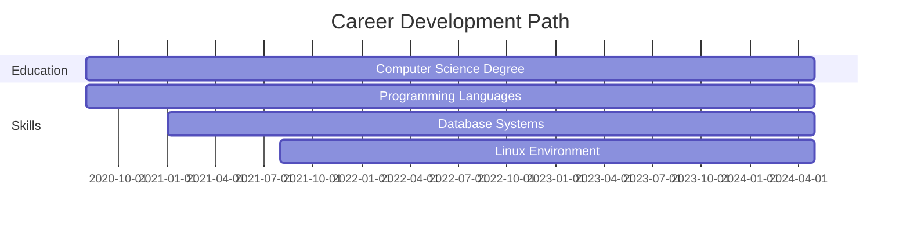

<div align="center">
  <h1>JAYANTH BOTTU</h1>
  <p><i>Building tomorrow's solutions with today's code</i></p>
  
  <br>
  
  
</div>

<hr>

## About Me

I am a Computer Science student passionate about developing elegant solutions to complex problems. With a strong foundation in multiple programming languages and technologies, I strive to create efficient, scalable, and user-centered applications.


## Expertise

```python
class JayanthBottu:
    def __init__(self):
        self.name = "Jayanth Bottu"
        self.role = "Computer Science Student"
        self.languages = ["Python", "C#", "Java", "C", "SQL"]
        self.environment = "Linux"
        self.interests = ["Software Development", 
                          "Data Structures",
                          "Algorithms",
                          "Database Systems"]
    
    def say_hello(self):
        return "Thanks for visiting my profile. Let's connect!"
```

## Analytics

<div align="center">
  
  
  
</div>

## Technical Proficiency

<div align="center">
  
  
  
  
  
  
</div>

## Professional Timeline



## Connect With Me

<div align="center">
  <a href="https://www.linkedin.com/in/jayanthbottu/" target="_blank">
    
  </a>
  <a href="mailto:jayanthindia8@gmail.com">
    
  </a>
  <a href="https://www.instagram.com/jayanthbottu/" target="_blank">
    
  </a>
</div>

<hr>

<div align="center">
  
</div>

<div align="center">
  <h3>📈 Contribution Activity</h3>
  
</div>
